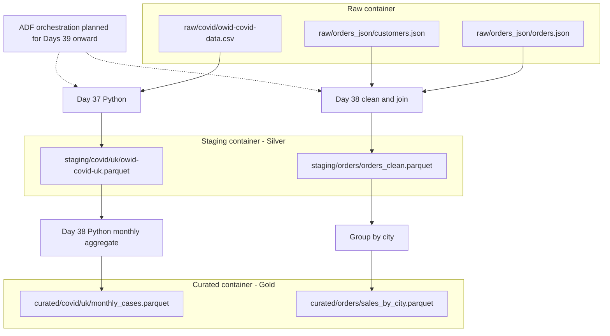

# Day 38 complete zone structure diagram

## Implemented paths

Raw:
- raw/covid/owid-covid-data.csv
- raw/orders_json/orders.json
- raw/orders_json/customers.json

Silver:
- staging/covid/uk/owid-covid-uk.parquet
- staging/orders/orders_clean.parquet

Gold:
- curated/covid/uk/monthly_cases.parquet
- curated/orders/sales_by_city.parquet

ADF orchestration is planned for Days 39 onward.
