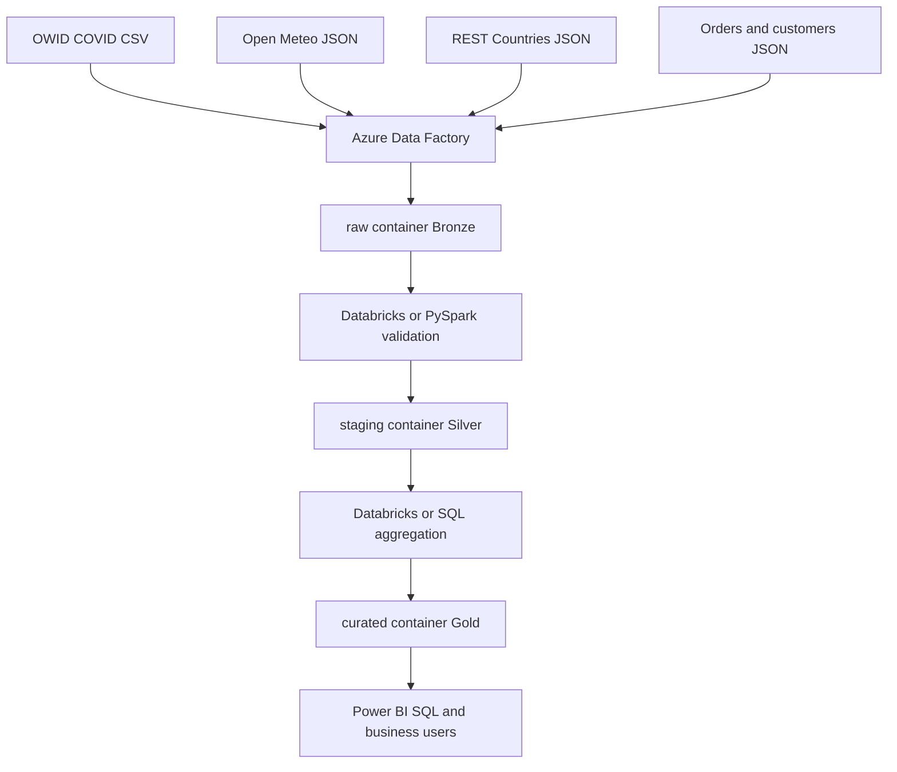

# Day 36 data lake architecture

- ADF orchestrates ingestion and dependencies.
- ADLS Gen2 stores Bronze, Silver and Gold.
- Databricks or PySpark validates and transforms.
- Gold supplies governed analytics outputs.
